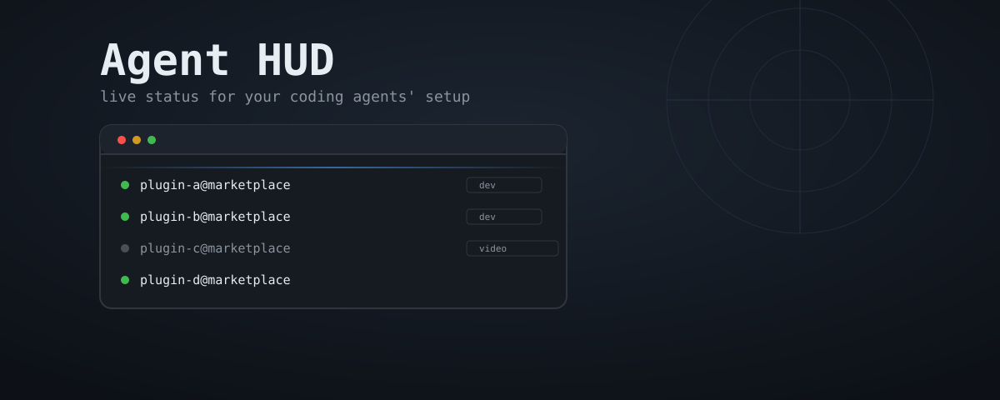
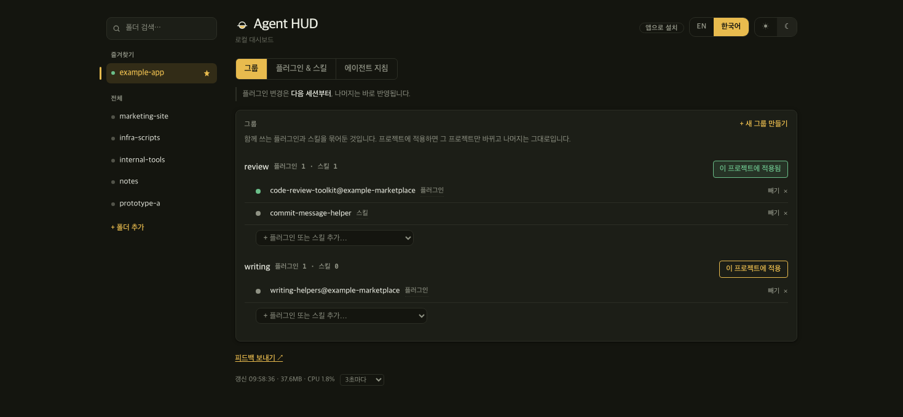
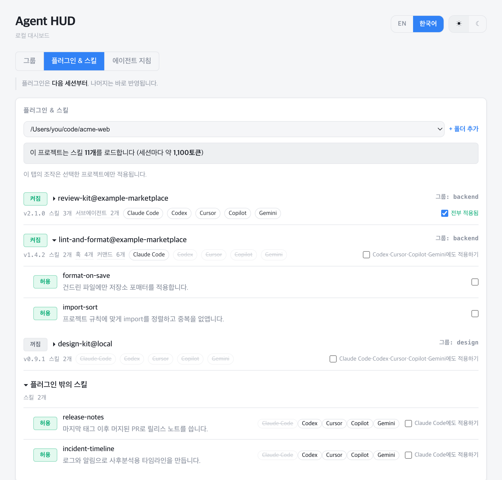
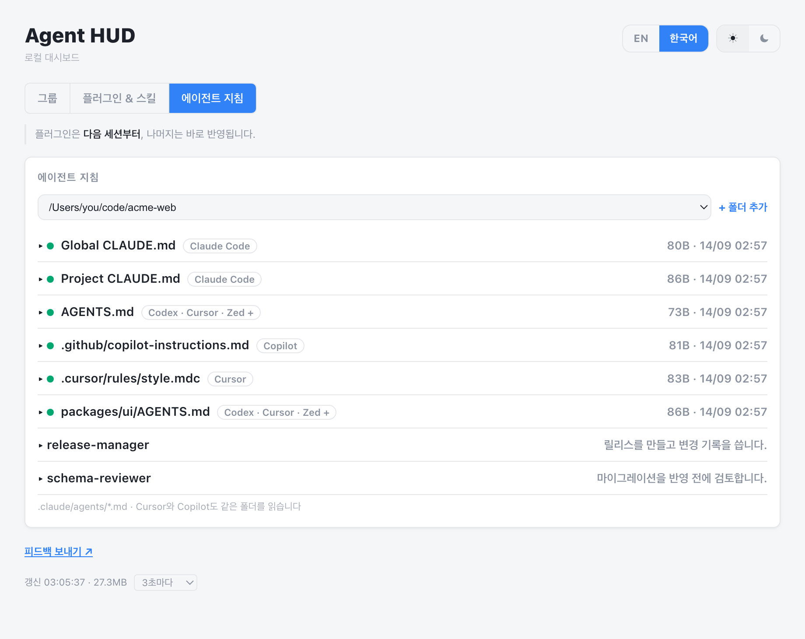

<p align="center">
  <a href="README.md"></a>
  <a href="README.ko.md"></a>
</p>

<p align="center"><b>For English, click the <a href="README.md">English</a> button above.</b></p>

<p align="center">
  
</p>

<p align="center">코딩 에이전트의 스킬·지침·플러그인 상태를 한 화면에 보여주는 로컬 대시보드</p>

## 목차

- [배경](#배경)
- [화면 구성](#화면-구성)
- [개념](#개념)
- [그룹 설정하기](#그룹-설정하기)
- [설치 (macOS)](#설치-macos)
- [여러 프로젝트·세션에서의 동작](#여러-프로젝트세션에서의-동작)
- [서비스 관리](#서비스-관리)
- [업데이트 확인](#업데이트-확인)
- [확장하기](#확장하기)
- [피드백](#피드백)
- [설계 근거](#설계-근거)
- [라이선스](#라이선스)

## 배경

Claude Code, Codex, Cursor 같은 코딩 에이전트는 세션을 시작할 때 설치된 스킬마다
이름과 설명을 모델 입력(컨텍스트)에 넣는다. 모델이 대화 중에 어떤 스킬을 쓸지
고르려면 스킬 목록이 필요하기 때문이다. 스킬 본문은 실제로 쓸 때만 읽지만, 이름과
설명은 그 세션에서 쓰지 않는 스킬까지 전부 들어간다.

Anthropic이 만들어 공개 표준으로 내놓은 [Agent Skills 명세](https://agentskills.io/specification)는
스킬 하나의 이름과 설명을 약 100토큰으로 본다. 이 도구를 만든 개발자의 컴퓨터에는 플러그인 3개로 스킬 60개가
설치되어 있었고, 실제 이름·설명 길이로 계산하면 세션마다 5,000~9,000토큰이었다.
앱 개발 프로젝트에서도 글쓰기용 스킬과 인프라용 스킬이 똑같이 포함된다.

Claude Code에서 플러그인을 끄는 기본 명령(`claude plugin disable`)은 사용자 전역
설정 파일에 기록한다. 그래서 한 프로젝트에서 끄면 다른 프로젝트에서도 꺼진다.
프로젝트를 바꿀 때마다 플러그인을 다시 켜고 꺼야 한다.

Agent HUD는 선택한 프로젝트에서 스킬이 몇 개 로드되는지 보여 준다. 함께 쓰는
플러그인과 스킬을 그룹으로 저장해 두고, 프로젝트마다 다른 그룹을 적용할 수 있다.
이 컴퓨터의 설정 파일만 읽고 쓰며, 계정이 필요 없다. 컴퓨터 밖으로 나가는 요청은 새
버전 확인용 GitHub Releases 조회뿐이다.

## 화면 구성

<p align="center">
  
  
  
</p>

탭은 그룹, 플러그인 & 스킬, 에이전트 지침 세 개이고, 한 번에 한 탭만 표시된다. 처음에는
그룹 탭이 열리고, 이후에는 마지막으로 본 탭이 열린다.

- **그룹**: 함께 쓰는 플러그인과 스킬의 목록. 그룹을 프로젝트에 적용하면 그룹의 스킬을
  그 프로젝트의 스킬 폴더에 연결하고, 그룹에 든 플러그인은 켜고 나머지 플러그인은 끈다.
  다른 프로젝트의 설정은 바꾸지 않는다.
- **플러그인 & 스킬**: 이 컴퓨터에 설치된 스킬 목록. 플러그인별로 나누고, 플러그인에
  속하지 않은 스킬은 별도 항목에 표시한다. 스킬마다 Claude Code·Codex·Cursor·
  Copilot·Gemini CLI 뱃지가 있다. 선택한 프로젝트에서 그 에이전트가 스킬을 읽을 수
  있으면 뱃지가 일반 글자로, 읽을 수 없으면 취소선으로 표시된다. 이 탭에서 플러그인
  켜기·끄기(켜짐/꺼짐 스위치)와 플러그인 스킬 차단(허용/차단 스위치)도 할 수 있다. 두
  기능은 Claude Code에만 있으며, 허용/차단 스위치에 마우스를 올리면 Claude Code에만
  적용된다는 설명이 표시된다.
- **에이전트 지침**: 프로젝트 폴더에서 `CLAUDE.md`, `AGENTS.md`, `.clinerules`,
  `.cursor/rules/` 등 30종의 지침 파일을 찾아 크기와 수정 시각을 표시한다. 에이전트마다
  지침 파일이 따로 있어서, 예를 들어 `CLAUDE.md`는 고쳤는데 `AGENTS.md`는 옛 내용으로
  남은 경우를 수정 시각으로 찾을 수 있다.
  등록된 서브에이전트 목록도 이 탭에 있다.

기본 테마는 다크 모드이고 ☀/☾ 버튼으로 바꿀 수 있다. EN/한국어 버튼으로 언어를 바꿀 수
있다. 두 설정 모두 브라우저의 `localStorage`에 저장된다.

## 개념

개념마다 어느 도구의 기능인지가 다르다.

| 개념 | 적용 범위 |
|---|---|
| [스킬](#스킬-공통) | 공통: Agent Skills 표준을 따르는 모든 에이전트 |
| [지침 파일](#지침-파일-에이전트별) | 에이전트별: 도구마다 파일 이름이 다름 |
| [플러그인](#플러그인-claude-code) | Claude Code |
| [마켓플레이스](#마켓플레이스-claude-code) | Claude Code |
| [권한 오버라이드](#권한-오버라이드-claude-code) | Claude Code |
| [그룹](#그룹-agent-hud) | Agent HUD |

### 스킬 [공통]

`SKILL.md` 파일과 필요한 부속 파일을 담은 폴더. [Agent Skills](https://agentskills.io)
표준 형식이라 Claude Code, Codex, Cursor, Copilot, Gemini CLI가 같은 폴더를 변환 없이
읽는다. 다만 에이전트마다 스킬을 찾는 폴더가 다르다. Claude Code는 `.claude/skills/`만,
Codex와 Gemini CLI는 `.agents/skills/`를, Cursor와 Copilot은 두 폴더를 모두 읽는다.
Agent HUD는 두 폴더에 심볼릭 링크를 만들어 스킬 하나를 다섯 에이전트가 모두 읽게 한다.

플러그인에 들어 있는 스킬은 그 플러그인을 켠 Claude Code만 읽는다. 플러그인 & 스킬 탭의
체크박스를 누르면 다른 에이전트의 스킬 폴더에도 연결된다. Agent HUD에서 플러그인 이름을
누르면 그 플러그인의 스킬 목록과 각 `SKILL.md`의 설명이 표시된다.

### 지침 파일 [에이전트별]

에이전트가 세션마다 읽는 마크다운 규칙 파일. Claude Code는 `CLAUDE.md`(전역
`~/.claude/CLAUDE.md`, 프로젝트 `<프로젝트>/CLAUDE.md`)를 읽고, Codex·Cursor 등은
`AGENTS.md`를, Cursor는 `.cursor/rules/`를, Copilot은 `.github/copilot-instructions.md`를
읽는다. Agent HUD는 이 파일들의 목록만 표시하고 내용은 수정하지 않는다.

### 플러그인 [Claude Code]

스킬, 서브에이전트, 커맨드, 훅을 묶어서 배포하는 단위. `claude plugin install`로
설치한다. 켜짐·꺼짐 값은 설정 파일의 `enabledPlugins`에 저장된다. Agent HUD에서
플러그인 옆 켜짐/꺼짐 스위치를 누르면 선택한 프로젝트의 `.claude/settings.local.json`에
이 값을 기록한다. 다른 프로젝트에는 영향이 없고, 다음 세션부터 적용된다.

### 마켓플레이스 [Claude Code]

플러그인을 내려받는 출처. git 저장소나 로컬 경로를 `claude plugin marketplace add`로 등록한다.
Agent HUD에서 플러그인 이름에 마우스를 올리면 출처가 표시된다. 마켓플레이스를 추가하거나
삭제하는 기능은 없다. 어떤 출처를 신뢰할지는 사용자가 `claude` CLI로 직접 결정해야 하기 때문이다.

### 권한 오버라이드 [Claude Code]

설정 파일의 `permissions.deny`에 `"Skill(플러그인:스킬)"` 형식으로 추가하는 항목.
플러그인 전체를 끄지 않고 스킬 하나만 막는 방법이다. Agent HUD에서 스킬 옆 허용/차단
스위치를 누르면
선택한 프로젝트의 `.claude/settings.local.json`에 이 항목을 추가하거나 삭제한다. 이 파일은
git에 커밋되지 않으므로 팀 저장소는 바뀌지 않는다. 플러그인 설정과 달리 바로 적용된다.

### 그룹 [Agent HUD]

Agent HUD에만 있는 기능. 함께 쓰는 플러그인과 스킬에 이름을 붙여 저장한 목록이다.
예를 들어 "글쓰기" 그룹과 "영상 편집" 그룹을 따로 만든다. 목록은 `modes.json`에 저장되고,
그룹 탭에서 관리하거나 파일을 직접 편집할 수 있다.

## 그룹 설정하기

1. 그룹 탭에서 "+ 새 그룹 만들기"를 누른다.
2. 그룹 이름을 입력하고, 처음 넣을 플러그인 하나를 선택한다.
3. 그룹 항목 아래의 "+ 플러그인 또는 스킬 추가…"에서 플러그인과 스킬을 더 넣는다.
4. 플러그인 & 스킬 탭에서 프로젝트를 선택한 뒤, 그룹 탭에서 "이 프로젝트에 적용"을 누른다.

적용하면 그룹의 스킬이 그 프로젝트의 스킬 폴더에 연결되고, 그룹에 든 플러그인은 켜지고
나머지 플러그인은 꺼진다. 다른 프로젝트의 설정은 바뀌지 않는다. 플러그인 변경은 다음
세션부터 적용된다.

터미널에서도 같은 작업을 할 수 있다.

```bash
python3 ~/.claude/tools/agent-hud/server.py groups          # 그룹 목록
python3 ~/.claude/tools/agent-hud/server.py apply dev       # 현재 폴더에 "dev" 그룹 적용
python3 ~/.claude/tools/agent-hud/server.py apply --off     # 현재 폴더의 그룹 해제
```

`modes.json`을 직접 편집해도 된다. 값을 목록 하나로만 쓰면 플러그인만 있는 그룹이 된다.

```json
{
  "dev": {
    "plugins": ["some-plugin@some-marketplace"],
    "skills": ["some-skill"]
  },
  "video": ["video-tools@local"]
}
```

플러그인 이름은 플러그인 & 스킬 탭에 표시된 이름과 `@마켓플레이스` 부분까지 같아야 한다.
스킬 이름은 스킬 폴더 이름이다. 파일을 저장하면 대시보드가 다음 조회 때 반영하므로
서비스를 재시작하지 않아도 된다.

## 설치 (macOS)

```bash
git clone https://github.com/ganggangstone/agent-hud.git agent-hud && cd agent-hud
./install.sh
```

설치 스크립트는 `server.py`를 `~/.claude/tools/agent-hud/`에 복사하고, 예제 파일로
`modes.json`을 만들고, `launchd` 서비스로 등록한다. 등록 후에는 터미널이나 Claude Code
세션을 닫아도 대시보드가 계속 실행되고, 프로세스가 종료되면 자동으로 다시 시작된다.

설치 스크립트는 `~/.claude/settings.json`에 추가할 훅 설정을 터미널에 출력한다. 이 훅은
Claude Code 세션이 시작될 때 프로젝트 경로를 대시보드에 등록한다. 설정 파일에 이미 들어
있는 다른 훅을 덮어쓰지 않도록 스크립트는 파일에 직접 쓰지 않는다. 출력된 내용을 직접
복사해 넣는다.

자동 등록은 Claude Code 세션에서만 된다. Gemini CLI, Codex, Cursor로만 작업하는 프로젝트는
대시보드의 "+ 폴더 추가"로 직접 추가한다. 추가한 뒤에는 그 에이전트의 스킬 뱃지와 그룹
적용이 똑같이 동작한다.

이 설치 방식은 `launchd`를 쓰므로 macOS에서만 동작한다. `server.py` 자체에는 운영체제별
코드가 없다. 리눅스에서는 `install.sh` 대신 `systemd --user` 유닛의 `ExecStart`에
`server.py`를 지정한다. Windows는 아직 지원하지 않는다([#1](../../issues/1)).

## 여러 프로젝트·세션에서의 동작

서버는 컴퓨터에서 하나만 실행되고 모든 프로젝트가 같은 서버를 쓴다. Claude Code 세션이
시작되면 훅이 실행 중인 서버가 있는지 확인한다. 서버가 있으면 현재 프로젝트 경로만
등록하고, 없으면 서버를 새로 실행한다. 같은 프로젝트에서 터미널을 열거나 닫아도 서버는
재시작되지 않고 포트도 바뀌지 않는다. 서버를 새로 실행할 때는 브라우저에 대시보드 탭이
열린다.

플러그인 & 스킬 탭과 에이전트 지침 탭의 제목 아래 드롭다운에서 프로젝트를 선택한다. 그룹
탭은 거기서 선택한 프로젝트에 적용된다. "+ 폴더 추가"로 훅 없이도 프로젝트를 추가할 수 있다.

## 서비스 관리

```bash
launchctl list | grep agent-hud                               # 실행 상태 확인
launchctl kickstart -k gui/$(id -u)/com.agent-hud             # server.py 수정 후 재시작
launchctl bootout gui/$(id -u) ~/Library/LaunchAgents/com.agent-hud.plist  # 중지
tail -f ~/.claude/tools/agent-hud/launchd.err.log             # 로그 보기
```

세션 훅이 실행되기 전에 환경변수 `CLAUDE_HUD_DISABLE=1`을 설정하면 그 세션은 서버를
실행하지도, 프로젝트를 등록하지도 않는다. 이 값이 설정된 동안에는 `groups`, `apply`
명령도 동작하지 않는다. 이미 실행 중인 서버는 계속 동작한다.

## 앱처럼 열기

기본은 브라우저 탭입니다. 브라우저 테두리 없이 창 하나에, 독립된 아이콘으로 열고 싶다면:

- **Chrome·Edge:** 대시보드를 연 상태에서 브라우저의 "앱으로 설치" 기능을 씁니다(Chrome:
  주소창 오른쪽 설치 아이콘, 또는 메뉴 → 도구 더보기 → "바로가기 만들기" 후 "창으로 열기"
  체크). macOS·Windows 둘 다 같은 방식입니다.
- **Safari(macOS 소노마 이상):** 파일 → Dock에 추가.

브라우저 자체의 앱 모드를 쓰는 것이라 Agent HUD가 따로 네이티브 래퍼를 만들 필요는 없습니다.

## 업데이트 확인

대시보드는 12시간마다 GitHub Releases에서 새 버전 태그를 확인하고, 새 버전이 있으면 화면
위쪽에 알림을 표시한다. 파일을 내려받거나 설치하지는 않는다. 업데이트하려면 저장소를
클론한 폴더에서 `git pull`을 실행한 뒤 `./install.sh`를 다시 실행한다. 서비스는
`~/.claude/tools/agent-hud/`에 복사된 파일을 실행하므로 `git pull`만으로는 바뀌지 않는다.

## 확장하기

패널을 추가하려면 `def collect_x(ctx) -> dict` 형태의 함수를 작성하고 `PANELS` 목록에
넣는다.

## 피드백

버그 제보와 제안은 [Issues](../../issues)에 남긴다. 대시보드 아래쪽의 "피드백 보내기 ↗"
링크를 누르면 버전이 미리 입력된 이슈 양식이 열린다. 영어와 한국어 모두 가능하다.

## 설계 근거

대안을 비교해서 정한 결정(의존성 없는 단일 파일, 플러그인·스킬 상태를 읽고 쓰는 방식,
웹소켓 대신 폴링을 쓰는 이유)은 [docs/ADR.md](docs/ADR.md)에 기록되어 있다.

## 라이선스

MIT. [LICENSE](LICENSE) 참고.
