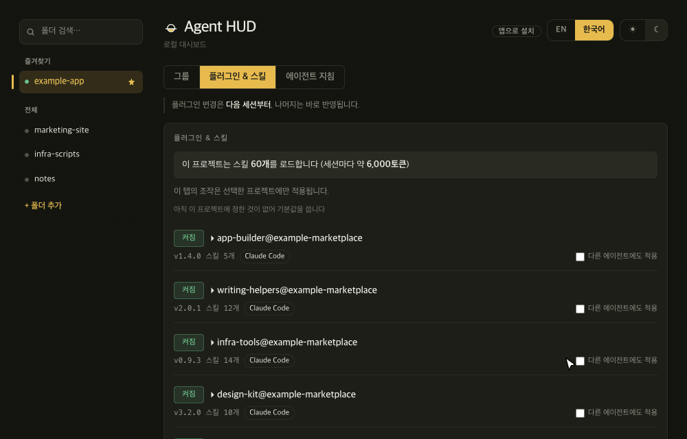
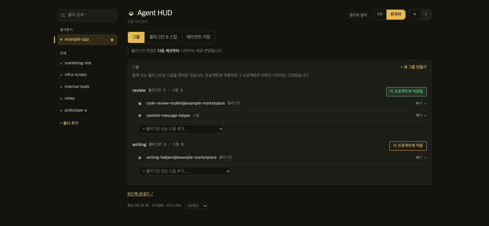
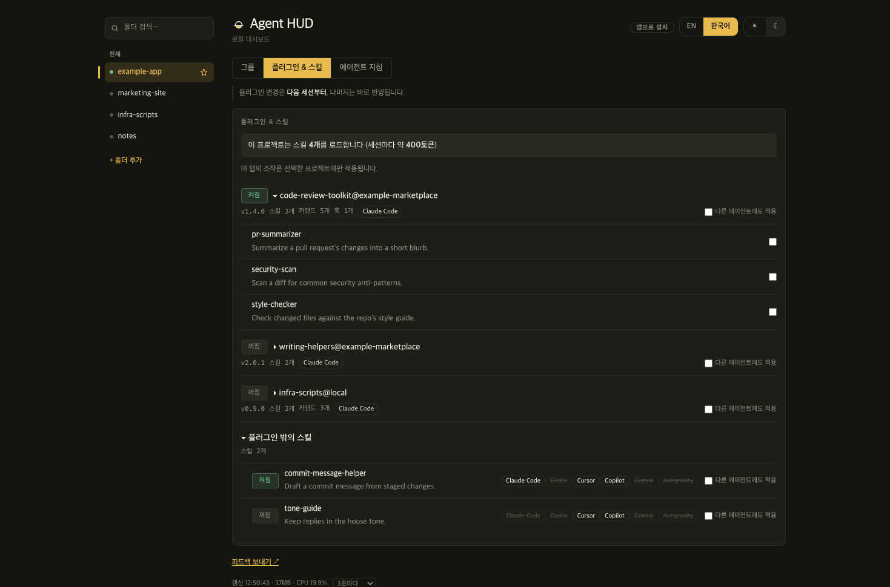
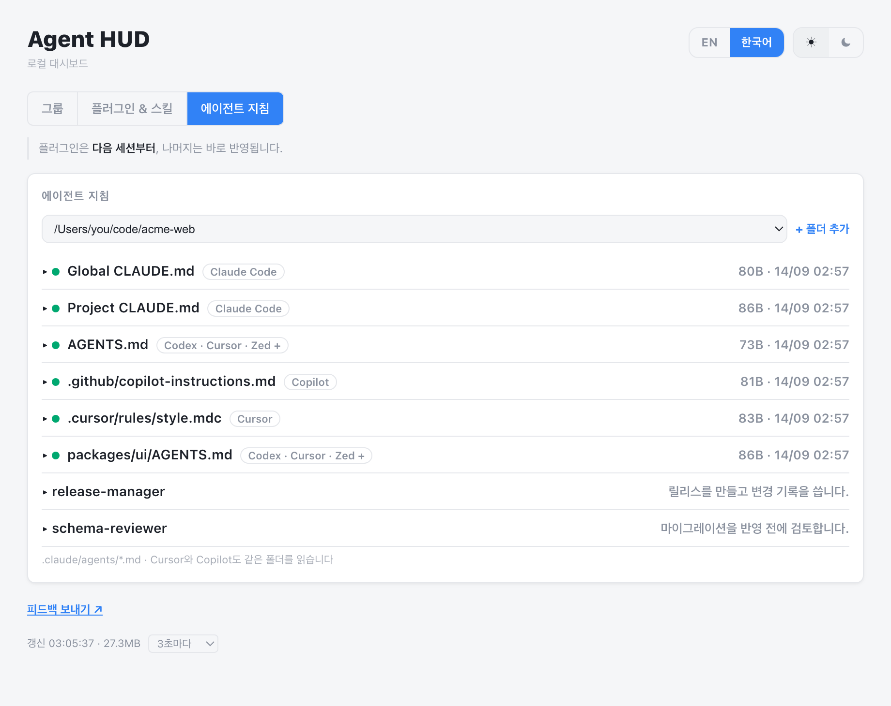

<p align="center">
  <a href="README.md"></a>
  <a href="README.ko.md"></a>
</p>

<p align="center"><b>For English, click the <a href="README.md">English</a> button above.</b></p>

<p align="center">
  
</p>

<p align="center">코딩 에이전트의 스킬·지침·플러그인 상태를 한 화면에 보여주는 로컬 대시보드</p>

<p align="center">
  <a href="https://ganggangstone.github.io/agent-hud/ko/">웹사이트</a> ·
  <a href="../../releases">릴리스</a> ·
  <a href="../../issues">이슈</a>
</p>

<p align="center">
  
</p>

Claude Code, Codex, Cursor 같은 코딩 에이전트는 세션을 시작할 때 설치된 스킬의 이름과
설명을 전부 컨텍스트에 넣는다. 그 세션에서 쓰지 않는 스킬도 빠지지 않는다. 만든 사람의
컴퓨터에서는 스킬 60개가 세션마다 5,000~9,000토큰을 차지했다.
`claude plugin disable <플러그인> -s local`로 프로젝트마다 끌 수는 있지만 하나씩 꺼야 하고,
스킬이 아직 몇 개 읽히는지는 보이지 않는다.

Agent HUD는 프로젝트마다 스킬이 몇 개 읽히는지 보여준다. 같이 쓰는 플러그인과 스킬을
그룹으로 묶어두고 프로젝트마다 다른 그룹을 적용할 수 있다.

## 빠른 시작 (macOS)

AI 코딩 에이전트를 쓰고 있다면 설치를 통째로 맡길 수 있다. Claude Code, Codex 등 쓰는
에이전트에 이렇게 말하면 된다.

> https://github.com/ganggangstone/agent-hud 에서 Agent HUD를 설치해줘. README의 "For AI agents" 절을 따라줘.

직접 설치하려면:

1. Homebrew로 설치한다. 응용 프로그램 폴더에 Agent HUD 앱이 생기고 `agent-hud` 명령도 깔린다.

   ```bash
   brew install --cask ganggangstone/tap/agent-hud-app
   ```

2. Launchpad나 응용 프로그램 폴더에서 **Agent HUD**를 연다. 브라우저에 대시보드
   (<http://127.0.0.1:41717>)가 열린다. 사이드바의 "+ 폴더 추가"로 작업 중인 프로젝트 폴더를 넣는다.
   Claude Code를 쓴다면 설치할 때 나온 훅 설정을 `~/.claude/settings.json`에 넣어 두면 이
   단계를 건너뛸 수 있다. 세션을 연 폴더가 알아서 들어간다.
3. 그룹 탭에서 그룹을 만들고 "이 프로젝트에 적용"을 누른다.

## 설치

위 명령은 Homebrew 패키지 두 개를 설치한다. 대시보드와 명령을 담은 `agent-hud` formula,
그리고 `agent-hud open`을 실행하는 앱 아이콘인 `agent-hud-app` cask다. 명령만 쓰려면:

```bash
brew install ganggangstone/tap/agent-hud
brew services start agent-hud
```

Homebrew를 쓰지 않는다면 저장소를 받아 설치 스크립트를 돌린다.

```bash
git clone https://github.com/ganggangstone/agent-hud.git agent-hud && cd agent-hud
./install.sh
```

설치 스크립트는 `server.py`를 `~/.claude/tools/agent-hud/`에 복사하고, `modes.json.example`을
본떠 `modes.json`을 만들고, `launchd` 서비스로 등록한다. 그래서 터미널을 닫아도 대시보드는
계속 돌고, 프로세스가 죽으면 다시 켜진다. Homebrew로 설치하면 `agent-hud` 명령이 생기고,
같은 서버를 `brew services`가 띄운다.

## 화면 구성

<p align="center">
  
  
  
</p>

- **그룹**: 같이 쓰는 플러그인과 스킬을 묶은 목록. 프로젝트에 적용하면 그룹의 스킬을
  그 프로젝트의 스킬 폴더에 연결하고, 그룹에 든 플러그인과 스킬만 켠다. 나머지 플러그인과
  플러그인 밖 스킬은 Claude Code에서 꺼진다. 다른 프로젝트는 그대로 둔다.
- **플러그인 & 스킬**: 설치된 스킬을 플러그인별로 보여준다. 선택한 프로젝트에서 그
  스킬을 읽을 수 있는 에이전트마다 뱃지가 붙는다. 플러그인과 플러그인 밖 스킬에는
  Claude Code용 켜짐/꺼짐 스위치가 있다.
- **에이전트 지침**: 프로젝트 안의 `CLAUDE.md`, `AGENTS.md`, `.cursor/rules/` 같은
  지침 파일 30종을 찾아 크기와 수정 시각을 보여준다. `CLAUDE.md`는 고쳤는데
  `AGENTS.md`는 그대로인 경우가 바로 보인다.

## 개념

| 개념 | 쓰는 도구 |
|---|---|
| [스킬](#스킬) | Agent Skills 표준을 따르는 모든 에이전트 |
| [지침 파일](#지침-파일) | 에이전트마다 따로, 파일 이름도 다름 |
| [플러그인](#플러그인) | Claude Code |
| [그룹](#그룹) | Agent HUD |

### 스킬

`SKILL.md` 파일이 든 폴더다. [Agent Skills](https://agentskills.io) 표준을 따르므로
여섯 에이전트가 같은 형식을 읽지만, 찾아보는 폴더는 다르다. 프로젝트 안에서 Claude
Code는 `.claude/skills/`를, Codex·Gemini CLI·Antigravity는 `.agents/skills/`를 읽고,
Cursor와 Copilot은 둘 다 읽는다. Agent HUD는 스킬을 복사하지 않고 두 폴더에 연결만 해서,
어느 폴더를 보는 에이전트든 같은 스킬을 읽는다. 연결을 따라 읽는지는 Claude Code·Codex·
Gemini CLI·Copilot·Antigravity에서 확인했고, Cursor는 아직 확인하지 않았다.

플러그인에 들지 않은 스킬은 `~/.claude/skills/`에 있든 프로젝트 안에 있든 프로젝트마다 끌 수
있다. Agent HUD가 프로젝트의 `.claude/settings.local.json`에 `skillOverrides`를 쓰고, 이
설정은 Claude Code만 읽는다.

플러그인에 든 스킬은 그 플러그인이 켜져 있을 때 Claude Code만 읽는다. 플러그인 & 스킬
탭의 체크박스를 누르면 프로젝트의 스킬 폴더에 연결되어, 다른 에이전트도 읽고 Claude Code는
플러그인이 꺼져 있어도 읽는다.

### 지침 파일

에이전트가 세션마다 읽는 마크다운 규칙 파일이다. Claude Code는 `CLAUDE.md`, Codex와
Cursor 등은 `AGENTS.md`, Cursor는 `.cursor/rules/`, Copilot은
`.github/copilot-instructions.md`를 읽는다. Agent HUD는 목록만 보여주고 고치지 않는다.

### 플러그인

스킬, 서브에이전트, 커맨드, 훅을 한꺼번에 설치하는 묶음이다. `claude plugin install`로
설치한다. Agent HUD에서 켜고 끈 값은 선택한 프로젝트의 `.claude/settings.local.json`의
`enabledPlugins`에만 적히므로, 다른 프로젝트는 바뀌지 않는다.

### 그룹

같이 쓰는 플러그인과 스킬에 이름을 붙여 묶어둔 것이다. "글쓰기", "영상 편집" 같은
이름으로 만든다. Agent HUD에만 있고 `modes.json`에 저장된다.

그룹에는 플러그인의 스킬, 사용자 스킬 폴더(`~/.claude/skills`, `~/.agents/skills` 등)의 스킬,
그리고 사이드바에 있는 프로젝트 가운데 한 곳 안에만 있는 스킬을 넣을 수 있다. 마지막 것은
목록에 어느 프로젝트 것인지 같이 나온다. 다른 프로젝트에는 그 프로젝트 폴더를 가리키는 링크가
걸리므로, 그 프로젝트를 옮기거나 지우면 링크가 끊긴다. 이름이 겹치면 플러그인, 사용자 스킬
폴더, 프로젝트 순으로 앞의 것을 쓴다.

## 그룹 만들기

1. 그룹 탭에서 "+ 새 그룹 만들기"를 누른다.
2. 이름을 적고 처음 넣을 플러그인을 고른다.
3. 그룹 아래의 "+ 플러그인 또는 스킬 추가…"에서 더 넣는다.
4. 사이드바에서 프로젝트를 고르고, 그룹 탭에서 "이 프로젝트에 적용"을 누른다.

### 적용되는 에이전트

그룹에 든 스킬은 모든 에이전트가 읽게 된다. 그룹에 없는 것을 끄는 건 Claude Code에만
적용된다. 다른 에이전트에는 프로젝트마다 스킬을 끄는 설정이 없기 때문이다.

| | 그룹에 든 것 | 그룹에 없는 것 |
|---|---|---|
| Claude Code | 켜진다 | 플러그인과 플러그인 밖 스킬이 꺼진다 |
| Codex, Gemini CLI, Antigravity, Cursor, Copilot | 스킬을 읽는다 | 꺼지지 않는다 |

여러 에이전트를 같이 쓴다면 스킬을 `~/.claude/skills`에 두고 그룹으로 연결하는 게 좋다.
Codex·Gemini CLI·Antigravity는 그룹으로 연결한 프로젝트에서만 그 스킬을 읽고, Claude Code는
프로젝트마다 켜고 끌 수 있다. `~/.agents/skills`에 둔 스킬은 Codex와 Gemini CLI가 모든
프로젝트에서 읽는다. Cursor와 Copilot은 두 폴더를 모두 전역으로 읽어서 프로젝트마다 나눌 수 없다.

터미널에서도 할 수 있다. Homebrew로 설치했다면 `python3 …/server.py` 대신 `agent-hud`를
쓴다.

```bash
python3 ~/.claude/tools/agent-hud/server.py groups          # 그룹 목록
python3 ~/.claude/tools/agent-hud/server.py apply dev       # 현재 폴더에 "dev" 그룹 적용
python3 ~/.claude/tools/agent-hud/server.py apply --off     # 그룹 스킬의 링크를 지운다(플러그인 켜짐/꺼짐은 그대로)
```

`modes.json`을 직접 고쳐도 된다. 값을 목록 하나로만 쓰면 플러그인만 든 그룹이 된다.

```json
{
  "dev": {
    "plugins": ["some-plugin@some-marketplace"],
    "skills": ["some-skill"]
  },
  "video": ["video-tools@local"]
}
```

플러그인 이름은 플러그인 & 스킬 탭에 나온 이름과 `@마켓플레이스` 부분까지 같아야 한다.
스킬 이름은 스킬 폴더 이름이다. 파일을 저장하면 대시보드가 다음 새로고침 때 읽으므로
아무것도 다시 시작하지 않아도 된다.

## 여러 프로젝트와 세션

서버는 컴퓨터에 하나만 돌고 모든 프로젝트가 같이 쓴다. 터미널을 열고 닫아도 서버가 다시
시작되거나 포트가 바뀌지 않는다.

## 서비스 관리

```bash
launchctl list | grep agent-hud                               # 돌고 있는지 확인
launchctl kickstart -k gui/$(id -u)/com.agent-hud             # 재시작
launchctl bootout gui/$(id -u) ~/Library/LaunchAgents/com.agent-hud.plist  # 다음 로그인까지 중지
tail -f ~/.claude/tools/agent-hud/launchd.err.log             # 로그 보기
```

Homebrew로 설치했다면 `brew services restart agent-hud`, `brew services stop agent-hud`를
쓴다. 로그는 `$(brew --prefix)/var/log/agent-hud.err.log`에 있다. `agent-hud open`은
대시보드를 브라우저로 연다. 꺼져 있으면 먼저 띄운다.

대시보드는 늘 41717번 포트를 쓴다. 그래서 북마크와 앱으로 설치한 아이콘이 계속 맞는 주소를
연다. 다른 프로그램이 이미 그 포트를 쓰고 있으면 다른 번호로 옮기지 않고 비기를 기다리며,
로그에 그렇게 적는다.

세션 훅이 돌기 전에 `CLAUDE_HUD_DISABLE=1`을 설정해 두면 그 세션에서는 서버가 뜨지 않고
프로젝트도 등록되지 않는다. `groups`와 `apply` 명령도 아무것도 하지 않는다. 이미 돌고
있는 서버는 그대로 돈다.

## 앱처럼 열기

화면 위쪽의 **앱으로 설치**를 누르면 브라우저 테두리 없는 창이 따로 뜨고, 전용 아이콘도 생긴다.
Chrome과 Edge에서는 바로 설치된다. 이 기능이 없는 브라우저(Safari 포함)에서는 직접
설치하는 메뉴 위치를 알려준다(Safari, macOS Sonoma 이상: 파일 → Dock에 추가).

## 업데이트

대시보드는 하루에 한 번 GitHub Releases에서 새 버전이 있는지 확인하고, 있으면 화면 위쪽에
알려준다.

- **Homebrew로 설치했다면** 알림의 **지금 업데이트**를 누른다. 대시보드가 `brew update`와
  `brew upgrade agent-hud`를 실행하고 새 코드로 다시 뜬 뒤 화면이 새로고침된다. 터미널에서는
  `brew update && brew upgrade agent-hud && brew services restart agent-hud`.
- **클론해서 설치했다면** **AI에게 보낼 문장 복사**를 눌러 에이전트에 붙여넣거나, 클론한
  폴더에서 `git pull` 뒤에 `./install.sh`를 실행한다. 서비스는 `~/.claude/tools/agent-hud/`에
  복사해 둔 파일을 돌리므로 `git pull`만으로는 바뀌지 않는다. `./install.sh`가 새 파일을
  복사하고 서비스를 다시 켠다.

대시보드가 스스로 보내는 요청은 하루 한 번의 이 확인뿐이다. 업데이트를 내려받는 건
**지금 업데이트**를 눌렀을 때뿐이고, 내려받는 일은 Homebrew가 한다. Agent HUD는 이 컴퓨터의
설정 파일만 읽고 고치며, 계정이 없어도 된다.

## 한계

- **macOS만 지원한다.** 설치 스크립트가 `launchd`를 쓰기 때문이다. `server.py`에는
  macOS 전용 코드가 없어서, 리눅스에서는 `systemd --user` 유닛으로 돌리면 된다.
  Windows는 아직 지원하지 않는다([#1](../../issues/1)).
- **플러그인을 켜고 끄면 다음 세션부터 적용된다.** Claude Code가 세션을 시작할 때
  플러그인 상태를 읽기 때문이다.
- **플러그인에 든 스킬 하나만 뺄 수는 없다.** `permissions.deny`에 넣으면 호출은
  막히지만 이름과 설명은 세션마다 그대로 들어가서 토큰이 줄지 않는다
  ([docs/ADR.md](docs/ADR.md) 10번). 플러그인을 통째로 꺼야 빠진다.

## 피드백과 기여

버그와 제안은 [Issues](../../issues)에 남긴다. 한국어로 써도 된다. 대시보드 아래쪽의
"피드백 보내기 ↗"를 누르면 버전이 미리 채워진 이슈 양식이 열린다. 클론한 폴더에서
직접 실행해 보거나, 검사를 돌리거나, 패널을 추가하려면 [CONTRIBUTING.md](CONTRIBUTING.md)를
본다. 설계를 어떻게 정했고 어떤 대안을 버렸는지는 [docs/ADR.md](docs/ADR.md)에 있다.

## 라이선스

MIT. [LICENSE](LICENSE) 참고.
