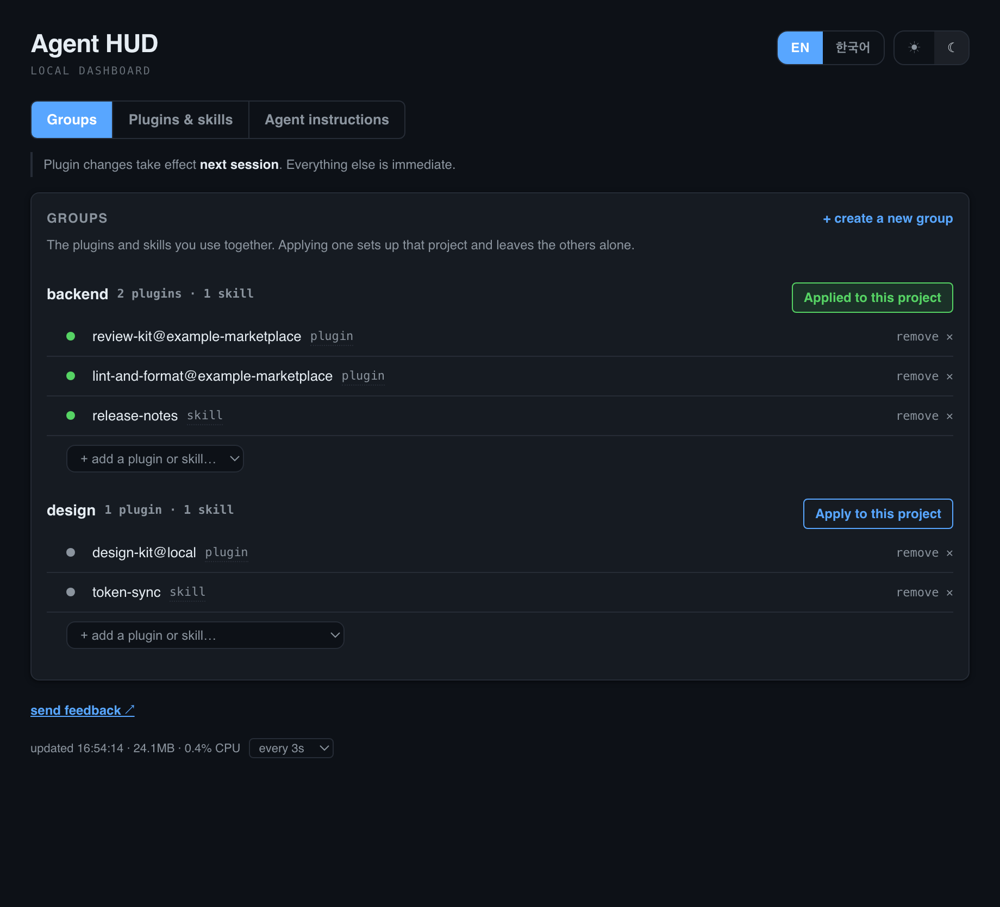
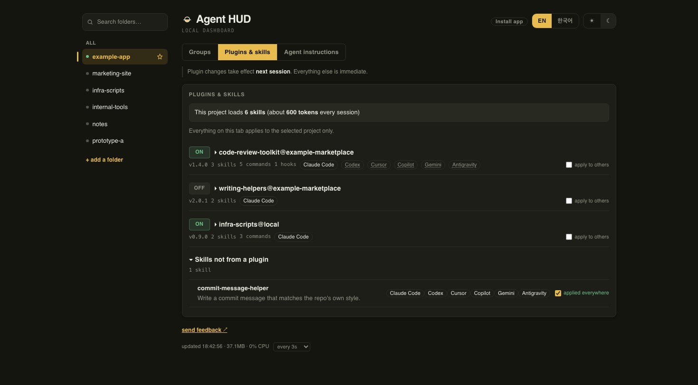
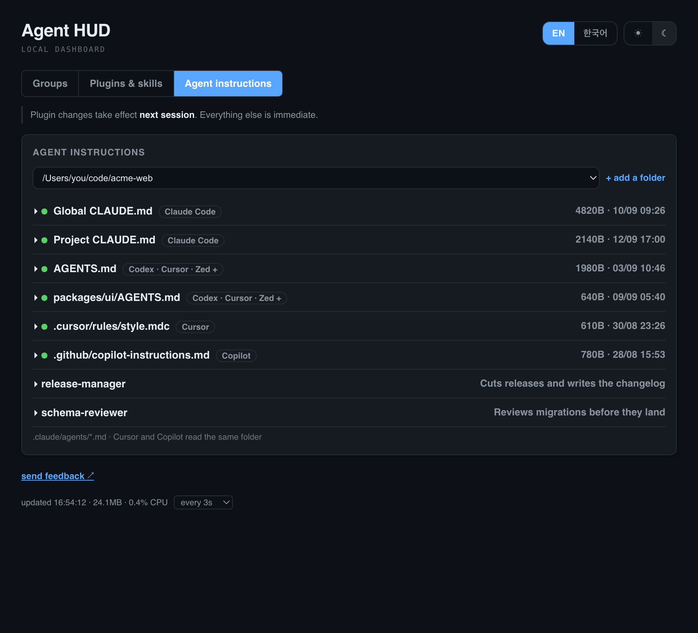

<p align="center">
  <a href="README.md"></a>
  <a href="README.ko.md"></a>
</p>

<p align="center"><b>한국어 설명은 위의 <a href="README.ko.md">한국어</a> 버튼을 누르세요.</b></p>

<p align="center">
  
</p>

<p align="center">A local dashboard for your coding agents' skills, instructions, and plugin state.</p>

## Contents

- [Background](#background)
- [What it shows](#what-it-shows)
- [Concepts](#concepts)
- [Setting up groups](#setting-up-groups)
- [Install (macOS)](#install-macos)
- [Behavior across projects and sessions](#behavior-across-projects-and-sessions)
- [Managing the service](#managing-the-service)
- [Open it as an app](#open-it-as-an-app)
- [Update checks](#update-checks)
- [Extend](#extend)
- [Feedback](#feedback)
- [Why it's built this way](#why-its-built-this-way)
- [License](#license)

## Background

Coding agents such as Claude Code, Codex and Cursor put the name and description of
every installed skill into the model's input (the context) when a session starts. The
model needs that list to choose a skill during the conversation. The agent reads a
skill's full body only when the skill is used, but it adds the name and description of
every installed skill to the context, including skills the session never uses.

The [Agent Skills specification](https://agentskills.io/specification), an open standard
originally developed by Anthropic, puts one skill's name and description at about 100 tokens. On the author's machine, three plugins had installed
60 skills. Measured by their actual names and descriptions, that came to 5,000–9,000
tokens per session. An app project loaded the writing skills and the infrastructure
skills too.

The default Claude Code command for turning a plugin off (`claude plugin disable`)
writes to the user-wide settings file. Turning a plugin off in one project turns it off
in every project, so you have to switch plugins again each time you change projects.

Agent HUD shows how many skills the selected project loads. You can save the plugins and
skills you use together as a group and apply a different group to each project. It reads
and writes settings files on this computer and needs no account. The only request that
leaves the computer is the GitHub Releases lookup that checks for a new version.

## What it shows

<p align="center">
  
  
  
</p>

The dashboard has three tabs, Groups, Plugins & skills and Agent instructions, and shows
one at a time. It opens on the Groups tab the first time, then on the last tab you used.

- **Groups**: lists of plugins and skills you use together. Applying a group to a project
  links the group's skills into that project's skill folders, turns the group's plugins
  on and every other plugin off. Other projects' settings are not changed.
- **Plugins & skills**: the skills installed on this computer, listed by plugin, with
  skills that belong to no plugin in a separate section. A plugin row carries a badge
  for each of Claude Code, Codex, Cursor, Copilot, Gemini CLI and Antigravity that can
  read its skills in the selected project; the agents that can't are listed in the
  checkbox tooltip instead of taking up a badge on every row. A skill inside the plugin
  repeats the badges only when it differs from its plugin, and then it shows all of
  them, struck through where that agent can't read it. This tab also turns Claude Code
  plugins on and off (ON/OFF switch).
- **Agent instructions**: finds 30 kinds of instruction files in the project folder,
  including `CLAUDE.md`, `AGENTS.md`, `.clinerules` and `.cursor/rules/`, and shows their
  size and modified time. Each agent has its own instruction file, so the modified times
  show, for example, that you updated `CLAUDE.md` but `AGENTS.md` still has the old
  content. Registered subagents are listed on this tab too.

The default theme is dark; the ☀/☾ buttons switch it. The EN/한국어 buttons switch the
language. Both settings are saved in the browser's `localStorage`.

## Concepts

Each concept belongs to a different tool.

| Concept | Scope |
|---|---|
| [Skill](#skill-shared) | Shared: every agent that follows the Agent Skills standard |
| [Instruction file](#instruction-file-per-agent) | Per agent: file names differ by tool |
| [Plugin](#plugin-claude-code) | Claude Code |
| [Marketplace](#marketplace-claude-code) | Claude Code |
| [Group](#group-agent-hud) | Agent HUD |

### Skill [Shared]

A folder containing a `SKILL.md` file and any supporting files. It follows the
[Agent Skills](https://agentskills.io) standard, so Claude Code, Codex, Cursor, Copilot,
Gemini CLI and Antigravity read the same folder without conversion. Each agent looks for
skills in a different folder: in a project, Claude Code reads only `.claude/skills/`,
Codex, Gemini CLI and Antigravity read `.agents/skills/`, and Cursor and Copilot read
both. Antigravity's global skills live in `~/.gemini/config/skills/`. Agent HUD creates
symbolic links in both project folders so all six agents can read one skill.

A skill inside a plugin is read only by Claude Code, with that plugin turned on. The
checkbox on the Plugins & skills tab links it into the other agents' skill folders too.
Clicking a plugin's name in Agent HUD shows its skills with the description from each
`SKILL.md`.

### Instruction file [Per agent]

A markdown rules file an agent reads every session. Claude Code reads `CLAUDE.md`
(global `~/.claude/CLAUDE.md` and per project `<project>/CLAUDE.md`), Codex, Cursor and
others read `AGENTS.md`, Cursor reads `.cursor/rules/`, and Copilot reads
`.github/copilot-instructions.md`. Agent HUD lists these files and never edits them.

### Plugin [Claude Code]

A bundle of skills, subagents, commands and hooks, installed with
`claude plugin install`. Whether a plugin is on is stored in `enabledPlugins` in a
settings file. Clicking the ON/OFF switch next to a plugin in Agent HUD writes that value into the
selected project's `.claude/settings.local.json`. Other projects are not affected, and
the change takes effect from the next session.

A single plugin skill cannot be kept out of the context on its own; turning the plugin
off is the only way. A `permissions.deny` entry such as `"Skill(plugin:skill)"` stops the
skill from being invoked, but the skill's name and description still load every session
(measured, see [docs/ADR.md](docs/ADR.md) section 10), so it saves no tokens. Agent HUD
therefore has no per-skill block switch.

### Marketplace [Claude Code]

The source plugins are downloaded from: a git repository or a local path, registered
with `claude plugin marketplace add`. Agent HUD shows a plugin's source when you hover its name,
but does not add or remove marketplaces. You decide which sources to trust, with the `claude` CLI.

### Group [Agent HUD]

A feature that exists only in Agent HUD: a named list of plugins and skills you use
together, for example a "writing" group and a "video editing" group. Groups are stored in
`modes.json`, and you can manage them in the Groups tab or edit the file directly.

## Setting up groups

1. In the Groups tab, click "+ create a new group".
2. Enter a name and choose the first plugin to add.
3. Add more plugins and skills from "+ add a plugin or skill…" under the group.
4. Select a project on the Plugins & skills tab, then click "Apply to this project" in the
   Groups tab.

Applying links the group's skills into that project's skill folders, turns the group's
plugins on and every other plugin off. Other projects' settings are not changed. Plugin
changes take effect from the next session.

The same from a terminal:

```bash
python3 ~/.claude/tools/agent-hud/server.py groups          # list groups
python3 ~/.claude/tools/agent-hud/server.py apply dev       # apply "dev" to the current folder
python3 ~/.claude/tools/agent-hud/server.py apply --off     # remove the group from the current folder
```

You can also edit `modes.json` directly. A value written as a single list is a group with
plugins only.

```json
{
  "dev": {
    "plugins": ["some-plugin@some-marketplace"],
    "skills": ["some-skill"]
  },
  "video": ["video-tools@local"]
}
```

Plugin names must match the names on the Plugins & skills tab, including the
`@marketplace` part. A skill name is the skill's folder name. After you save the file,
the dashboard picks it up on its next refresh, so you don't need to restart the service.

## Install (macOS)

```bash
git clone https://github.com/ganggangstone/agent-hud.git agent-hud && cd agent-hud
./install.sh
```

Homebrew works too, and gives you an `agent-hud` command as well.

```bash
brew install ganggangstone/tap/agent-hud
```

The install script copies `server.py` to `~/.claude/tools/agent-hud/`, creates
`modes.json` from the example file, and registers a `launchd` service. After that the
dashboard keeps running when you close terminals or Claude Code sessions, and restarts
automatically if the process exits.

The install script prints a hook setting to add to `~/.claude/settings.json`. The hook
registers the project path with the dashboard when a Claude Code session starts. The
script does not write the file itself, so it can't overwrite hooks you already have. Copy
the printed setting in yourself.

Only Claude Code sessions register a project automatically. For a project you work on
only with Gemini CLI, Antigravity, Codex or Cursor, add it with "+ add a folder" in the dashboard.
After that, the skill badges and group apply work for those agents the same way.

This install method uses `launchd`, so it works on macOS only. `server.py` itself has no
OS-specific code. On Linux, set `server.py` as the `ExecStart` of a `systemd --user` unit
instead of running `install.sh`. Windows is not supported yet ([#1](../../issues/1)).

## Behavior across projects and sessions

One server runs on the computer and every project uses it. When a Claude Code session
starts, the hook checks whether a server is running. If one is, the hook only registers
the current project path; if not, it starts a new server. Opening or closing a terminal
in the same project does not restart the server or change its port. Starting a new server
opens the dashboard in a browser tab.

Older versions wrote skill-block entries in the form `Skill(plugin@marketplace:skill)`,
which Claude Code ignores. When the server starts or a project is registered, Agent HUD
removes only entries in that form from the project's `.claude/settings.local.json` and
`.claude/settings.json`, and logs what it removed. Other rules are left as they are.

The Plugins & skills and Agent instructions tabs have a project dropdown under the title;
the Groups tab applies to the project selected there. "+ add a folder" adds a project
without the hook.

## Managing the service

```bash
launchctl list | grep agent-hud                               # check it is running
launchctl kickstart -k gui/$(id -u)/com.agent-hud             # restart after editing server.py
launchctl bootout gui/$(id -u) ~/Library/LaunchAgents/com.agent-hud.plist  # stop
tail -f ~/.claude/tools/agent-hud/launchd.err.log             # view logs
```

If the environment variable `CLAUDE_HUD_DISABLE=1` is set before a session's hook runs,
that session neither starts a server nor registers its project. The `groups` and `apply`
commands also do nothing while it is set. A server that is already running keeps running.

## Open it as an app

To get a window without browser chrome and its own icon, click **Install
app** in the header. On Chrome or Edge that installs it in one step (macOS
and Windows alike). Browsers without that API — Safari included — show
instead where to find their own manual step (Safari: File → Add to Dock).

This uses the browser's own app-mode; Agent HUD doesn't need a native wrapper
for it.

## Update checks

Every 12 hours the dashboard checks GitHub Releases for a new version tag and shows a
notice at the top of the page when one exists. It never downloads or installs anything.
If you cloned it, run `git pull` in that folder and then `./install.sh` again — the
service runs the copy in `~/.claude/tools/agent-hud/`, so `git pull` alone does not change
it. If you installed with Homebrew, run `brew upgrade agent-hud`.

## Extend

To add a panel, write a function of the form `def collect_x(ctx) -> dict` and add it to
the `PANELS` list.

## Feedback

Report bugs and suggestions in [Issues](../../issues). The "send feedback ↗" link at the
bottom of the dashboard opens an issue form with the version already filled in. English
and Korean are both fine.

## Releases

Pushing a `v*` tag builds the release from GitHub Actions, so the update notice in the
dashboard has something to point at. Checks run on every push and pull request.

## Why it's built this way

Decisions made by comparing alternatives (a single file with no dependencies, how plugin
and skill state is read and written, why polling is used instead of websockets) are
recorded in [docs/ADR.md](docs/ADR.md).

## License

MIT. See [LICENSE](LICENSE).
