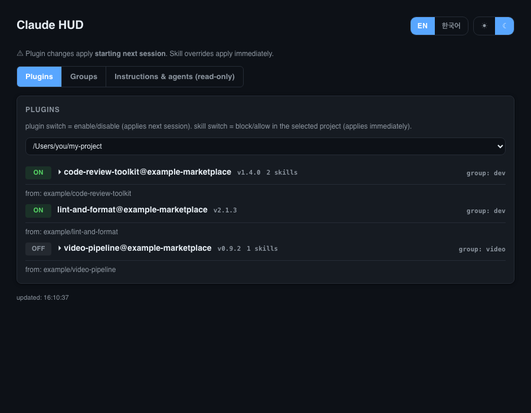
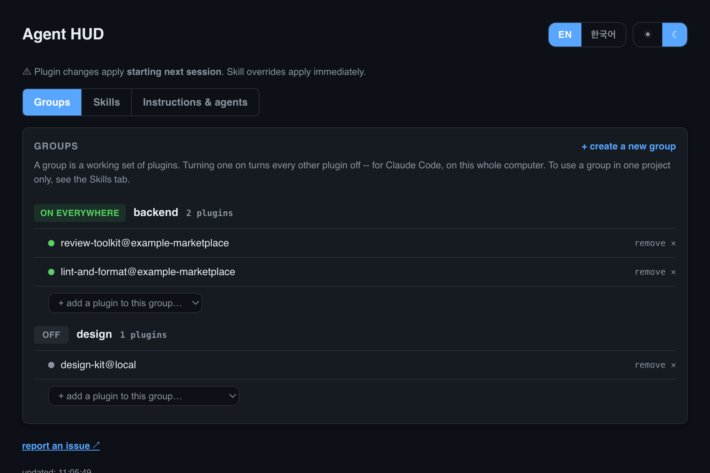
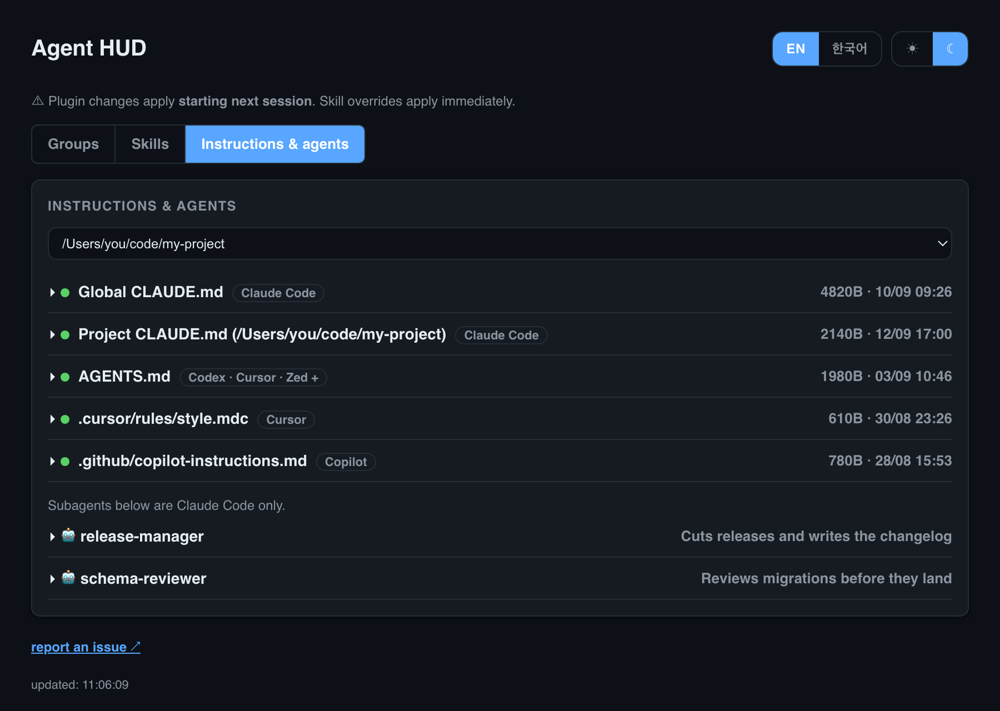

<p align="center">
  
</p>

<p align="center">A local dashboard for your coding agents' skills, instructions, and plugin state.</p>

<p align="center">코딩 에이전트의 스킬·지침·플러그인 상태를 한 화면에 보여주는 로컬 대시보드</p>

<p align="center">
  
</p>

## Contents / 목차

- [The problem / 배경](#the-problem--배경)
- [What it shows / 화면 구성](#what-it-shows--화면-구성)
- [Concepts / 개념](#concepts--개념)
- [Setting up groups / 그룹 설정하기](#setting-up-groups--그룹-설정하기)
- [Install (macOS) / 설치](#install-macos--설치)
- [Behavior across projects and sessions / 여러 프로젝트·세션에서의 동작](#behavior-across-projects-and-sessions--여러-프로젝트세션에서의-동작)
- [Managing the service / 서비스 관리](#managing-the-service--서비스-관리)
- [Update checks / 업데이트 확인](#update-checks--업데이트-확인)
- [Extend / 확장하기](#extend--확장하기)
- [Feedback / 피드백](#feedback--피드백)
- [Why it's built this way / 설계 근거](#why-its-built-this-way--설계-근거)
- [License / 라이선스](#license--라이선스)

## The problem / 배경

Different projects need different skills. Writing, app work and infrastructure
have almost nothing in common — but every skill you have installed is loaded in
every session regardless, because a skill's name and description go into context
at startup whether you use it or not.

Three plugins on this machine turned out to carry **60 skills** between them,
plus commands and hooks. At roughly 100 tokens of metadata per skill — the figure
the [Agent Skills spec](https://agentskills.io/specification) gives — that is
**5,000–9,000 tokens spent in every session**, most of it on skills irrelevant to
whatever the project is.

You can turn plugins off, but the switch is one setting shared by every project,
so "on for this kind of work" and "on everywhere" are the same thing. Doing it by
hand at the start of each session gets old fast.

Agent HUD shows what each project actually loads, and lets you save the set you
use for that kind of work and apply it per project. It reads local files and
renders them; no accounts, no external services.

> 프로젝트마다 쓰는 스킬이 다르다. 글쓰기, 앱 개발, 인프라는 겹치는 게 거의 없는데,
> 설치한 스킬은 쓰든 안 쓰든 전부 세션에 올라간다. 스킬의 이름과 설명이 시작할 때
> 컨텍스트에 들어가기 때문이다.
>
> 이 기계에서는 플러그인 3개가 스킬 60개를 들고 있었다(커맨드와 훅은 별도).
> [명세](https://agentskills.io/specification)가 말하는 스킬당 약 100토큰으로 치면
> 세션마다 5,000~9,000토큰이고, 대부분은 그 프로젝트와 상관없는 스킬이다.
>
> 플러그인을 끌 수는 있지만 그 스위치는 모든 프로젝트가 공유한다. "이 작업에만 켠다"와
> "어디서나 켠다"가 같은 뜻이 되고, 세션마다 손으로 바꾸는 건 금방 질린다.
>
> Agent HUD는 지금 이 프로젝트가 무엇을 로드하는지 보여주고, 작업 종류별로 묶어서
> 프로젝트마다 적용하게 한다. 로컬 파일을 읽어서 그리는 게 전부다. 계정도 외부
> 서비스도 없다.

## What it shows / 화면 구성

Three tabs, one panel at a time.

- **Skills**: every skill on the machine, grouped by where it came from -- each
  plugin, plus the ones that belong to no plugin. Each skill carries a badge per
  agent (Claude Code, Codex, Cursor, Copilot, Gemini CLI) showing which of them
  can actually see it in the selected project. Plugin on/off and per-project skill
  blocking live here too, labelled Claude Code only, because no other agent has
  those concepts
- **Groups**: saved plugin sets. Turning one on turns every other plugin off, for
  Claude Code, on the whole computer
- **Instructions & agents**: `CLAUDE.md`, `AGENTS.md`, `.clinerules`,
  `.cursor/rules/` and 25 other instruction files, with size and modified time, so
  you can see where they have drifted apart. Plus registered subagents

Dark mode by default (☀/☾ toggle) and an EN/한국어 toggle, both persisted to
`localStorage`.

> 탭 세 개로 나뉘어 한 번에 한 패널만 보여준다.
>
> - **스킬**: 이 기계의 모든 스킬을 출처별로 묶어서 보여준다 — 플러그인별 묶음과,
>   플러그인에 속하지 않은 것들. 스킬마다 에이전트 뱃지(Claude Code·Codex·Cursor·
>   Copilot·Gemini CLI)가 붙어서, 선택한 프로젝트에서 **누가 그 스킬을 볼 수 있는지**
>   드러난다. 플러그인 on/off와 프로젝트별 스킬 차단도 여기 있고, 다른 에이전트엔
>   대응 개념이 없으므로 `Claude Code 전용`이라고 표시된다
> - **그룹**: 저장해둔 플러그인 묶음. 하나를 켜면 나머지는 전부 꺼진다.
>   Claude Code 기준이고 이 컴퓨터 전체에 적용된다
> - **지침 · 에이전트**: `CLAUDE.md`, `AGENTS.md`, `.clinerules`, `.cursor/rules/` 등
>   29종을 크기·수정시각과 함께 보여준다. 어디가 갈라졌는지 눈에 보이게 하는 목적이다.
>   등록된 서브에이전트도 함께
>
> 기본값은 다크모드(☀/☾ 토글)이고 EN/한국어 토글도 있다. 둘 다 `localStorage`에 저장된다.

<p align="center">
  
</p>

<p align="center"><sub>Same tab in 한국어 and the light theme. Both toggles are in the header.</sub></p>

<p align="center">
  
  
</p>

## Concepts / 개념

These are Claude Code's own structure, not Agent HUD's, except where noted.

> 아래 항목은 표시된 것을 제외하면 Agent HUD가 만든 개념이 아니라 Claude Code
> 자체의 구조다.

**Plugin**: an installable bundle of skills, agents, and commands, published to
a marketplace and installed with `claude plugin install`. You enable or disable
the whole plugin per machine, with `claude plugin enable|disable`, not per
project. The plugin dot in Agent HUD controls this. A change here applies
from the next session.

> **플러그인(Plugin)**: 마켓플레이스에 배포되고 `claude plugin install`로
> 설치하는 스킬·에이전트·커맨드 묶음이다. 플러그인 전체를 `claude plugin
> enable|disable`로 머신 단위로 켜고 끈다. 프로젝트 단위가 아니다. Agent HUD의
> 플러그인 점(dot)이 이걸 제어한다. 여기서 바꾼 건 다음 세션부터 적용된다.

**Marketplace**: the source a plugin comes from, a git repo or a local path,
registered with `claude marketplace add`. Each plugin row shows its
marketplace's source path directly, so there's no separate marketplace list to
cross-reference. Agent HUD only displays this. It doesn't add or manage
marketplaces. Trusting a source is a deliberate, manual decision you make with
the `claude` CLI, not something a dashboard should do on your behalf.

> **마켓플레이스(Marketplace)**: 플러그인의 출처다. git 저장소나 로컬 경로이며
> `claude marketplace add`로 등록한다. 각 플러그인 행에 그 마켓플레이스의 출처
> 경로가 바로 표시되므로 따로 대조할 목록이 필요 없다. Agent HUD는 이걸
> 보여주기만 한다. 마켓플레이스를 추가하거나 관리하지는 않는다. 어떤 출처를
> 신뢰할지는 `claude` CLI로 직접 내리는 판단이어야지, 대시보드가 대신할 일이
> 아니다.

**Skill**: a capability defined by a `SKILL.md` file, bundled inside a plugin.
Claude Code's plugin system enables or disables a whole plugin at once, it has
no separate "skill toggle." Individual skills are controlled a different way:
see permission override below. Click a plugin's name in Agent HUD to expand
its skill list, each with its description read from `SKILL.md`.

> **스킬(Skill)**: 플러그인 안에 `SKILL.md`로 정의된 개별 기능이다. Claude
> Code의 플러그인 시스템은 플러그인 전체를 한 번에 켜고 끌 뿐, 스킬 하나만
> 따로 켜고 끄는 기능은 없다. 스킬 단위 제어는 다른 방식으로 이뤄진다. 아래
> 권한 오버라이드를 보라. Agent HUD에서 플러그인 이름을 클릭하면 스킬
> 목록이 펼쳐지고, `SKILL.md`에서 읽어온 설명이 각각 붙어 있다.

**Permission override**: a project-local `.claude/settings.json` entry under
`permissions.deny`, for example `"Skill(some-plugin:some-skill)"`. This is
Claude Code's actual mechanism for turning off one specific skill without
touching the rest of its plugin, and it's scoped to a single project rather
than the whole machine. The skill dot in Agent HUD writes this entry
directly, so blocking or allowing a skill applies immediately, unlike plugin
enable/disable.

> **권한 오버라이드(Permission override)**: 프로젝트 로컬
> `.claude/settings.json`의 `permissions.deny`에 들어가는
> `"Skill(플러그인:스킬)"` 같은 항목이다. 이게 바로 Claude Code가 스킬 하나만
> 끄는 실제 메커니즘이다. 그 플러그인의 나머지 스킬은 건드리지 않고, 머신
> 전체가 아니라 프로젝트 하나에만 적용된다. Agent HUD의 스킬 점이 이 항목을
> 직접 쓰고 지운다. 그래서 플러그인 enable/disable과 달리 차단·허용이 즉시
> 반영된다.

**Group**: Agent HUD's own addition. Claude Code has no such concept. It's a
named set of plugins meant to be enabled together, for example "writing" versus
"video." Stored in `modes.json`. Edit the file directly, or use the `+` button
and group tags on each plugin row in the dashboard.

> **그룹(Group)**: Agent HUD가 추가한 개념이다. Claude Code엔 없다. 같이 켜고
> 끄고 싶은 플러그인 묶음에 붙인 이름이다. 예를 들면 "글쓰기"와 "영상"을
> 구분한다. `modes.json`에 저장되며, 파일을 직접 고치거나 대시보드에서 각
> 플러그인 행의 `+` 버튼과 그룹 태그로 관리한다.

**Instructions (`CLAUDE.md`)**: global (`~/.claude/CLAUDE.md`) and per-project
(`<project>/CLAUDE.md`) markdown. Claude Code reads it as standing instructions
every session.

> **지침(`CLAUDE.md`)**: 전역(`~/.claude/CLAUDE.md`)과 프로젝트별
> (`<프로젝트>/CLAUDE.md`) 마크다운이다. Claude Code가 매 세션 상시 지침으로
> 읽는다.

## Setting up groups / 그룹 설정하기

In the Groups tab, click "+ create a new group", give it a name, and pick which
plugin it starts with. Click INACTIVE on a group to switch to it: every plugin
in that group turns on, every plugin not in it turns off, in one action.

You can skip the UI and edit `modes.json` directly instead:

> Groups 탭에서 "+ 새 그룹"을 누르고 이름을 정한 다음 시작할 플러그인 하나를 고르면
> 된다. 그룹의 "비활성" 표시를 클릭하면 그 그룹으로 전환된다. 그룹 안 플러그인은
> 켜지고 나머지는 전부 꺼진다.
>
> UI 대신 `modes.json`을 직접 편집해도 된다:

```json
{
  "dev": ["some-plugin@some-marketplace", "another-plugin@another-marketplace"],
  "video": ["video-tools@local"]
}
```

Plugin names have to match what shows up in the Plugins tab exactly, including
the `@marketplace` part. The dashboard picks the file up on its next poll, no
restart needed.

> 플러그인 이름은 Plugins 탭에 나오는 이름과 `@마켓플레이스` 부분까지 정확히 일치해야
> 한다. 저장하면 대시보드가 다음 폴링 때 알아서 반영한다. 재시작할 필요 없다.

## Install (macOS) / 설치

```bash
git clone https://github.com/ganggangstone/agent-hud.git agent-hud && cd agent-hud
./install.sh
```

Running the installer copies `server.py` to `~/.claude/tools/agent-hud/`,
seeds `modes.json` from the example, and registers a `launchd` service. From
then on the dashboard keeps running independently of any terminal or Claude
Code session, and restarts automatically if it dies.

It prints, but does not apply, a hook snippet for `~/.claude/settings.json` so
each Claude Code session registers its project directory with the dashboard.
Merge it in by hand. The installer won't touch a settings file that may
already hold hooks of your own.

This packaging needs `launchd`, so it's macOS-only. `server.py` itself has no
OS-specific code. On Linux, point a `systemd --user` unit's `ExecStart` at it
instead of running `install.sh`.

> 설치 스크립트를 실행하면 `server.py`가 `~/.claude/tools/agent-hud/`에
> 복사되고, 예제로 `modes.json`이 만들어지고, `launchd` 서비스로 등록된다.
> 이후 대시보드는 터미널이나 Claude Code 세션과 무관하게 계속 떠 있고, 죽으면
> 자동으로 다시 켜진다.
>
> `~/.claude/settings.json`에 추가할 훅 스니펫은 화면에 출력만 된다. 직접
> 적용되지는 않는다. 이미 다른 훅이 들어 있을 수 있는 설정 파일을 스크립트가
> 함부로 덮어쓰지 않기 위해서다. 출력된 내용을 손으로 병합해 넣으면 된다.
>
> `launchd`가 필요해서 이 패키징은 macOS 전용이다. `server.py` 자체엔 OS
> 종속 코드가 없다. 리눅스에서는 `install.sh` 대신 `systemd --user` 유닛의
> `ExecStart`가 `server.py`를 가리키게 하면 된다.

## Behavior across projects and sessions / 여러 프로젝트·세션에서의 동작

One server process serves every project on the machine. When a session
starts, its hook checks whether a server is already running. If one is, it
just registers the current project path. It starts a new one only if none is
running. Opening and closing terminals in the same project doesn't start or
stop the server, and doesn't change its port. With two or more known projects,
the relevant panels show a dropdown to switch between them.

> 서버 프로세스 하나가 이 머신의 모든 프로젝트를 상대한다. 세션이 시작되면
> 훅이 이미 떠 있는 서버가 있는지 확인한다. 있으면 현재 프로젝트 경로만
> 등록하고, 없을 때만 새로 하나 띄운다. 같은 프로젝트에서 터미널을 열고 닫는
> 동작은 서버를 시작하거나 멈추지 않고 포트도 바꾸지 않는다. 알려진 프로젝트가
> 2개 이상이면 관련 패널에 드롭다운이 생겨 전환할 수 있다.

## Managing the service / 서비스 관리

```bash
launchctl list | grep agent-hud                               # status
launchctl kickstart -k gui/$(id -u)/com.agent-hud             # restart after editing server.py
launchctl bootout gui/$(id -u) ~/Library/LaunchAgents/com.agent-hud.plist  # stop
tail -f ~/.claude/tools/agent-hud/launchd.err.log             # logs
```

Setting `CLAUDE_HUD_DISABLE=1` before a session's hook runs skips starting a
new server. It has no effect on one already running.

> 세션 훅이 실행되기 전에 `CLAUDE_HUD_DISABLE=1`을 설정하면 새 서버를 띄우지
> 않는다. 이미 떠 있는 서버에는 영향이 없다.

## Update checks / 업데이트 확인

The dashboard checks GitHub Releases for a newer tag every 12 hours, in a
background thread, and shows a banner when one exists. It never downloads or
installs anything. You update by running `git pull` in your clone and
restarting the service. Set `UPDATE_REPO` in `server.py` to the repo you
publish to; until then the check quietly does nothing.

> 대시보드는 12시간마다 백그라운드 스레드에서 GitHub Releases의 최신 태그를
> 확인하고, 새 버전이 있으면 배너를 띄운다. 다운로드나 설치는 하지 않는다.
> 업데이트는 클론에서 `git pull` 후 서비스를 재시작하면 된다. `server.py`의
> `UPDATE_REPO`를 배포할 저장소로 맞춰두면 되고, 그전까지는 조용히 아무 일도
> 하지 않는다.

## Extend / 확장하기

- New panel: write `def collect_x(ctx) -> dict` and add it to `PANELS`.
- New plugin group: edit `modes.json`, or use the "+" button in the Groups tab.

> - 새 패널: `def collect_x(ctx) -> dict` 함수를 작성해서 `PANELS`에 추가
> - 새 플러그인 그룹: `modes.json`을 직접 편집하거나 Groups 탭의 "+" 버튼 사용

## Feedback / 피드백

Bug reports and suggestions go to [Issues](../../issues). The dashboard's
"report an issue" link opens a short form with the version already filled in.
Write in English or Korean, whichever is easier.

> 버그 제보와 제안은 [Issues](../../issues)로 받는다. 대시보드의 "문제 신고하기"
> 링크를 누르면 버전이 미리 채워진 짧은 폼이 열린다. 영어든 한국어든 편한 쪽으로
> 쓰면 된다.

## Why it's built this way / 설계 근거

Decisions with real alternatives — the single-file/no-dependency choice, why
reads go straight to the config files but plugin toggles go through the `claude`
CLI, why polling instead of websockets — are recorded in [docs/ADR.md](docs/ADR.md).

> 대안이 있었던 결정들(의존성 없는 단일 파일, 읽기는 설정 파일 직접·플러그인 토글은
> `claude` CLI 경유인 이유, 웹소켓 대신 폴링인 이유)은 [docs/ADR.md](docs/ADR.md)에 있다.

## License / 라이선스

MIT. See [LICENSE](LICENSE).
