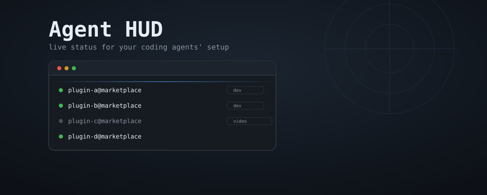
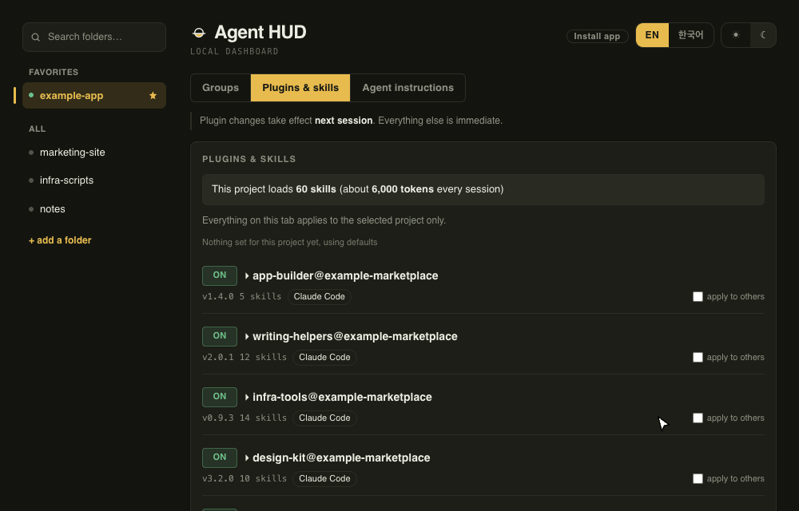
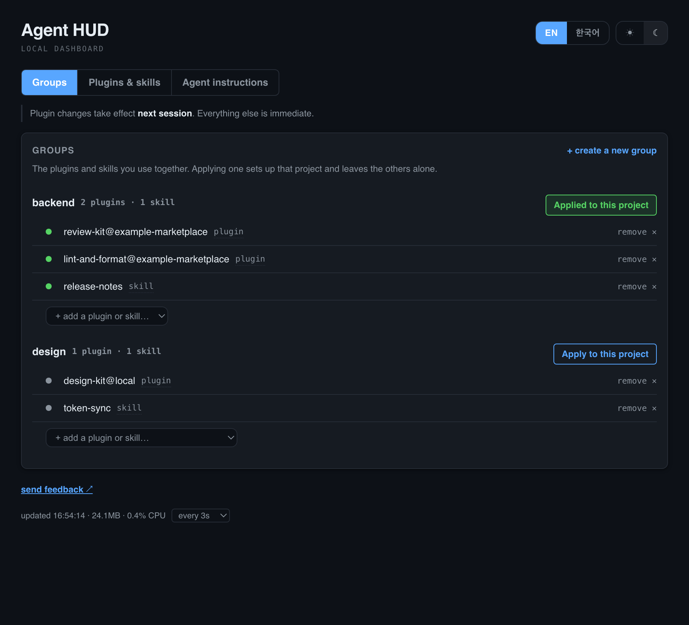
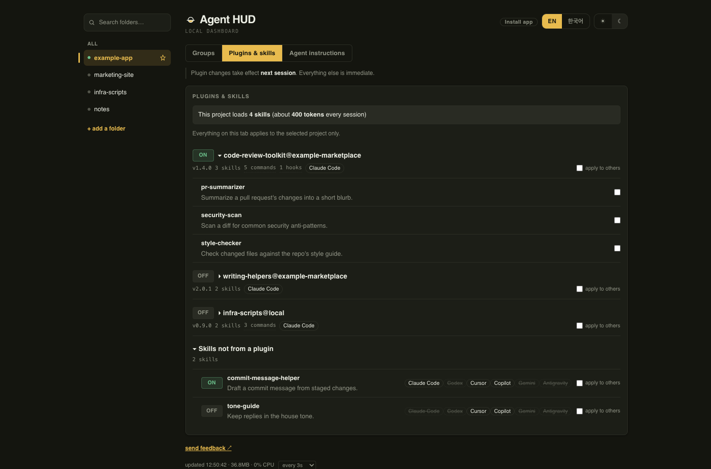
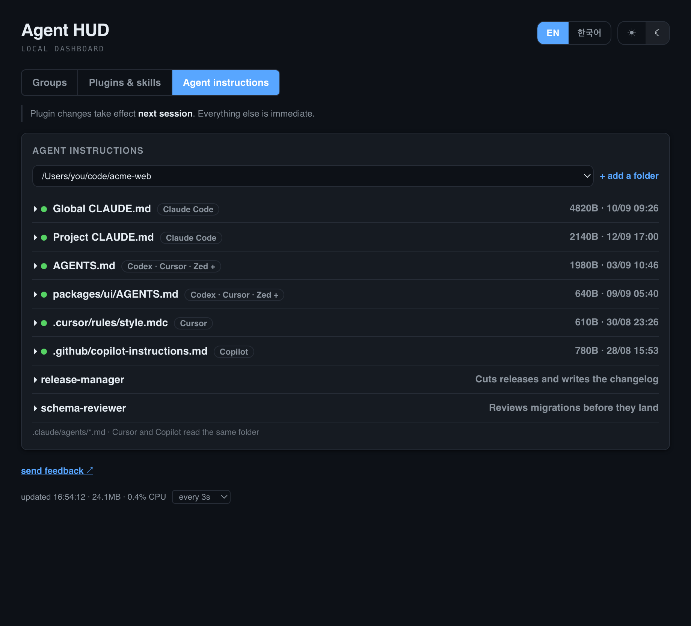

<p align="center">
  <a href="README.md"></a>
  <a href="README.ko.md"></a>
</p>

<p align="center"><b>한국어 설명은 위의 <a href="README.ko.md">한국어</a> 버튼을 누르세요.</b></p>

<p align="center">
  
</p>

<p align="center">A local dashboard for your coding agents' skills, instructions, and plugin state.</p>

<p align="center">
  <a href="https://ganggangstone.github.io/agent-hud/">Website</a> ·
  <a href="../../releases">Releases</a> ·
  <a href="../../issues">Issues</a>
</p>

<p align="center">
  
</p>

Coding agents such as Claude Code, Codex and Cursor put the name and description of every
installed skill into the context at the start of each session, including skills that
session never uses. On the author's machine, 60 skills came to 5,000–9,000 tokens per
session. `claude plugin disable <plugin> -s local` turns a plugin off for one project, but only
one plugin at a time, and nothing shows how many skills are still loaded.

Agent HUD shows how many skills each project loads, and lets you save the plugins and
skills you use together as a group and apply a different group to each project.

## Quickstart (macOS)

1. Install it with Homebrew.

   ```bash
   brew install ganggangstone/tap/agent-hud
   brew services start agent-hud
   ```

2. Open <http://127.0.0.1:7717> and add the project folder you work in with "+ add a folder"
   in the sidebar. If you use Claude Code, paste the hook setting the installer prints into
   `~/.claude/settings.json` and you can skip this: each folder you open a session in is added
   for you.
3. In the Groups tab, create a group and click "Apply to this project".

## Install

Without Homebrew, clone the repository and run the install script:

```bash
git clone https://github.com/ganggangstone/agent-hud.git agent-hud && cd agent-hud
./install.sh
```

The install script copies `server.py` to `~/.claude/tools/agent-hud/`, creates
`modes.json` from the example file, and registers a `launchd` service, so the dashboard
keeps running after you close terminals and restarts if the process exits. Homebrew
installs an `agent-hud` command and runs the same server with `brew services`.

## What it shows

<p align="center">
  
  
  
</p>

- **Groups**: lists of plugins and skills you use together. Applying a group to a project
  links the group's skills into that project's skill folders and turns on its plugins and
  skills. Every other plugin, and every skill outside a plugin, is turned off for Claude
  Code. Other projects are not changed.
- **Plugins & skills**: every installed skill, listed by plugin, with a badge for each
  agent that can read it in the selected project. Plugins, and skills that aren't part of
  a plugin, have an ON/OFF switch for Claude Code.
- **Agent instructions**: 30 kinds of instruction files in the project, such as
  `CLAUDE.md`, `AGENTS.md` and `.cursor/rules/`, with their size and modified time.
  You can see at a glance that `CLAUDE.md` was updated but `AGENTS.md` wasn't.

## Concepts

| Concept | Belongs to |
|---|---|
| [Skill](#skill) | Every agent that follows the Agent Skills standard |
| [Instruction file](#instruction-file) | Each agent, with its own file name |
| [Plugin](#plugin) | Claude Code |
| [Group](#group) | Agent HUD |

### Skill

A folder with a `SKILL.md` file, following the [Agent Skills](https://agentskills.io)
standard. The six agents read the same format but look in different folders: in a
project, Claude Code reads `.claude/skills/`, Codex, Gemini CLI and Antigravity read
`.agents/skills/`, and Cursor and Copilot read both. Agent HUD links the skill into both
folders instead of copying it, so an agent reads the same copy whichever folder it looks in.
Following the link was checked with Claude Code, Codex, Gemini CLI, Copilot and Antigravity,
not yet with Cursor.

A skill that isn't part of a plugin, whether in `~/.claude/skills/` or in the project, can
be switched off per project. Agent HUD writes `skillOverrides` into the project's
`.claude/settings.local.json`, which only Claude Code reads.

A skill inside a plugin is read only by Claude Code, while that plugin is on. The checkbox
on the Plugins & skills tab links it into the project's skill folders, so the other agents
read it too, and Claude Code reads it even with the plugin off.

### Instruction file

A markdown rules file an agent reads every session: `CLAUDE.md` for Claude Code,
`AGENTS.md` for Codex, Cursor and others, `.cursor/rules/` for Cursor,
`.github/copilot-instructions.md` for Copilot. Agent HUD lists these files and never
edits them.

### Plugin

A bundle of skills, subagents, commands and hooks, installed with
`claude plugin install`. The ON/OFF switch in Agent HUD writes `enabledPlugins` into the
selected project's `.claude/settings.local.json`, so other projects are not affected.

### Group

A named list of plugins and skills you use together, such as "writing" or "video
editing". Groups exist only in Agent HUD and are stored in `modes.json`.

## Setting up groups

1. In the Groups tab, click "+ create a new group".
2. Enter a name and choose the first plugin to add.
3. Add more plugins and skills from "+ add a plugin or skill…" under the group.
4. Pick a project in the sidebar, then click "Apply to this project" in the Groups tab.

### What changes for each agent

Every agent gets to read the group's skills. Switching off what isn't in the group applies
to Claude Code only, because the other agents have no per-project setting for turning a
skill off.

| | In the group | Not in the group |
|---|---|---|
| Claude Code | On | Plugins and skills outside a plugin are turned off |
| Codex, Gemini CLI, Antigravity, Cursor, Copilot | Skills are read | Stay as they are |

If you use more than one agent, keep your skills in `~/.claude/skills` and link them with
groups. Codex, Gemini CLI and Antigravity then read a skill only in the projects a group
linked it into, and Claude Code can switch it per project. A skill in `~/.agents/skills` is
read by Codex and Gemini CLI in every project. Cursor and Copilot read both folders
everywhere, so they can't be split per project.

The same from a terminal (`agent-hud` instead of `python3 …/server.py` if you installed
with Homebrew):

```bash
python3 ~/.claude/tools/agent-hud/server.py groups          # list groups
python3 ~/.claude/tools/agent-hud/server.py apply dev       # apply "dev" to the current folder
python3 ~/.claude/tools/agent-hud/server.py apply --off     # remove the group's skill links (plugin on/off stays)
```

You can also edit `modes.json` directly. A value written as a single list is a group with
plugins only.

```json
{
  "dev": {
    "plugins": ["some-plugin@some-marketplace"],
    "skills": ["some-skill"]
  },
  "video": ["video-tools@local"]
}
```

Plugin names must match the names on the Plugins & skills tab, including the
`@marketplace` part. A skill name is the skill's folder name. The dashboard picks up the
saved file on its next refresh, so you don't need to restart anything.

## Behavior across projects and sessions

One server runs on the computer and every project uses it. Opening or closing terminals
does not restart the server or change its port.

## Managing the service

```bash
launchctl list | grep agent-hud                               # check it is running
launchctl kickstart -k gui/$(id -u)/com.agent-hud             # restart
launchctl bootout gui/$(id -u) ~/Library/LaunchAgents/com.agent-hud.plist  # stop until next login
tail -f ~/.claude/tools/agent-hud/launchd.err.log             # view logs
```

With Homebrew, use `brew services restart agent-hud` and `brew services stop agent-hud`;
logs are in `$(brew --prefix)/var/log/agent-hud.err.log`.

If `CLAUDE_HUD_DISABLE=1` is set before a session's hook runs, that session neither starts
a server nor registers its project, and `groups` and `apply` do nothing. A server that is
already running keeps running.

## Open it as an app

Click **Install app** in the header to get a window without browser chrome and with its
own icon. Chrome and Edge install it in one step. In other browsers,
including Safari, it tells you which menu to use instead (Safari on macOS Sonoma or later: File → Add to Dock).

## Update checks

Once a day the dashboard checks GitHub Releases for a new version and shows a notice at
the top of the page when there is one. It never downloads or installs anything. If you
cloned it, run `git pull` and then `./install.sh` again, because the service runs the copy
in `~/.claude/tools/agent-hud/`. With Homebrew, run `brew upgrade agent-hud`.

This check is the only request that leaves the computer. Agent HUD reads and writes
settings files on this computer only and needs no account.

## Known limitations

- **macOS only.** The installer relies on `launchd`. `server.py` has no macOS-only code,
  so on Linux you can run it from a `systemd --user` unit instead. Windows is not
  supported yet ([#1](../../issues/1)).
- **Plugin changes take effect from the next session.** Claude Code reads plugin state
  when a session starts.
- **You can't hide one skill of a plugin.** A `permissions.deny` entry stops the skill
  from being invoked, but its name and description still load every session, so it
  saves no tokens ([docs/ADR.md](docs/ADR.md) section 10). Turning the whole plugin off
  is the only way.

## Feedback and contributing

Report bugs and suggestions in [Issues](../../issues), in English or Korean. The "send
feedback ↗" link at the bottom of the dashboard opens an issue form with the version
already filled in. To run it from a checkout, run the checks, or add a panel, see
[CONTRIBUTING.md](CONTRIBUTING.md). Design decisions and the alternatives behind them
are in [docs/ADR.md](docs/ADR.md).

## License

MIT. See [LICENSE](LICENSE).
